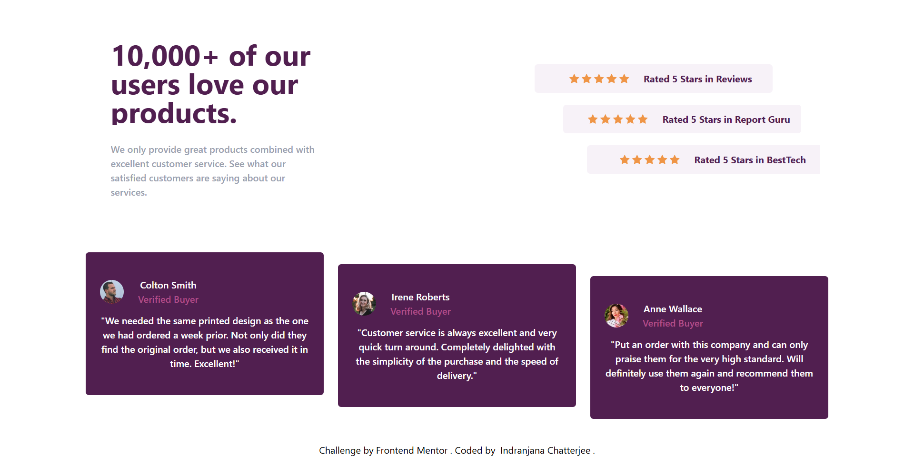

# Frontend Mentor - Social proof section solution

This is a solution to the [Social proof section challenge on Frontend Mentor](https://www.frontendmentor.io/challenges/social-proof-section-6e0qTv_bA). Frontend Mentor challenges help you improve your coding skills by building realistic projects.

## Overview

### Screenshot

### Links

- Solution URL: [solution URL](https://github.com/IndranjanaChatterjee/Social-proof-section)
- Live Site URL: [live site URL](https://intro-component-with-sign-up-form-seven-omega.vercel.app/)

### Built with

- Semantic HTML5 markup
- CSS custom properties
- Flexbox
- CSS Grid
- Mobile-first workflow
- [React](https://reactjs.org/) - JS library
- Tailwind CSS

## Author

- Website - [URL](https://intro-component-with-sign-up-form-seven-omega.vercel.app/)
- Frontend Mentor - [Indranjana Chatterjee](https://www.frontendmentor.io/profile/IndranjanaChatterjee)

